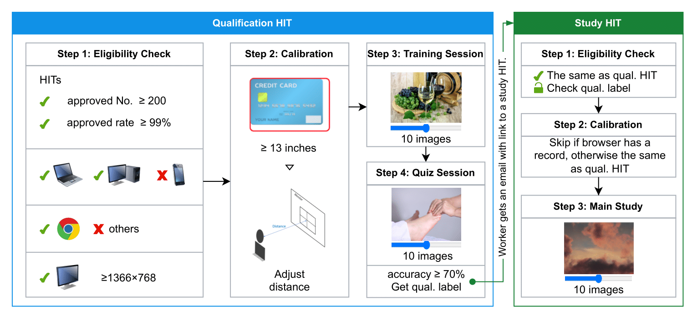
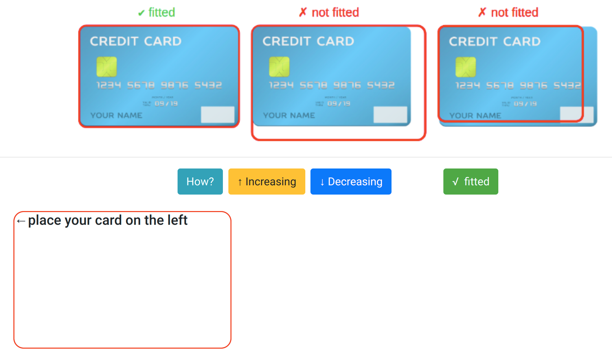
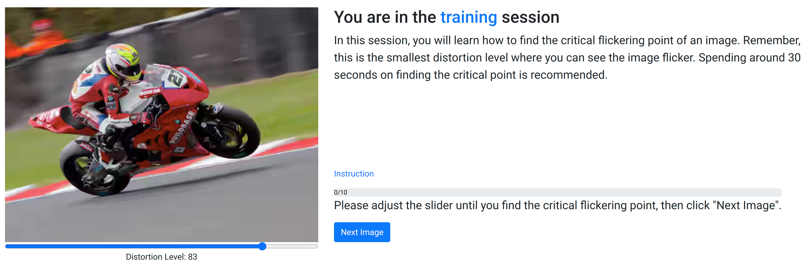
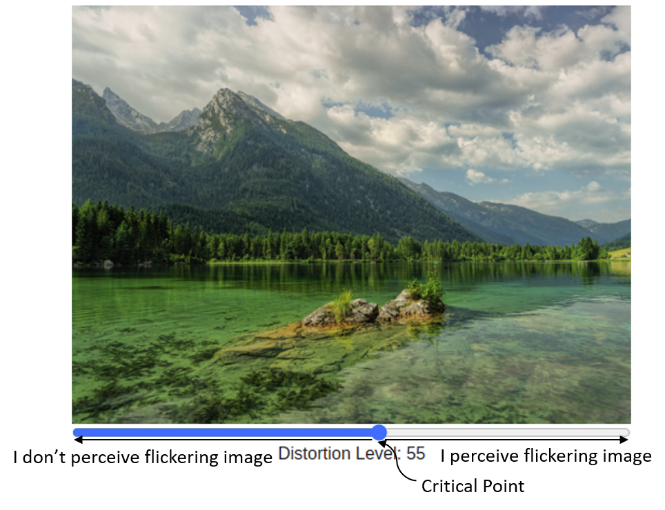

KonJND-1k
======

About
-----

Konstanz just noticeable difference database (KonJND-1k) contains 1,008 source images with two compression schemes, JPEG and BPG. A total of 503 unique workers participated in the study, yielding 61,030 PJND ratings and resulting in an average of 42 ratings per image. KonJND-1k is freely available to the research community. If you use our GUI or database in your research, please cite:

    @article{konjnd1k,
        author={Lin, Hanhe and Chen, Guangan and Jenadeleh, Mohsen and Hosu, Vlad and Reips, Ulf-Dietrich and Hamzaoui, Raouf and Saupe,Dietmar},
        journal={IEEE Transactions on Circuits and Systems for Video Technology},
        title={Large-scale crowdsourced subjective assessment of picturewise just noticeable difference},
        year={2022}
    }

Download
--------
paper: [Large-scale crowdsourced subjective assessment of picturewise just noticeable difference](https://datasets.vqa.mmsp-kn.de/archives/papers/JND_dataset_accepted_version.pdf)  
database: [KonJND-1k database](http://database.mmsp-kn.de/konjnd-1k-database.html)

Introduction of GUI
-------------------
* The source code is in ./GUI/code. To have an offline demo, please open the html file using Chrome.  
* Workflow of the crowdsourced experiment in Amazon Mechanical Turk (AMT)

* Calibration  

  
* Experiment  

* Flickering  

* Critical flickering point 
